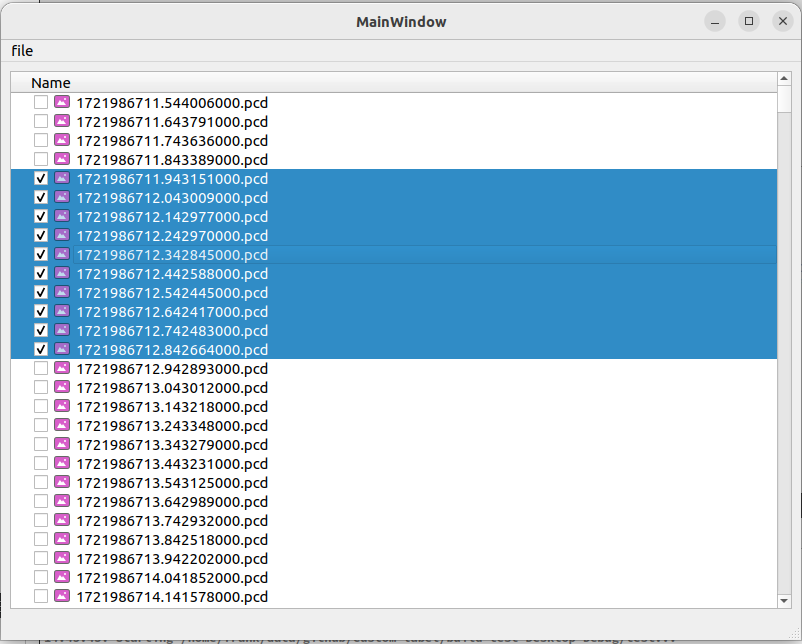

# custom-label

# 编译

```shell
mkdir build && cd build
cmake ..
make -j4
sudo make install
```

# 链接

```shell
cd /usr/lib/x86_64-linux-gnu/qt5/plugins/designer
sudo ln -s /usr/local/lib/calib_plugin/libcalib_plugin.so .
```

# 使用

```shell
find_package(calib_plugin REQUIRED)
target_include_directories(test PUBLIC ${calib_plugin_INCLUDE_DIRS})
target_link_libraries(xxx PRIVATE calib_plugin)
```

# 插件列表

* CheckTreeView
  
*
